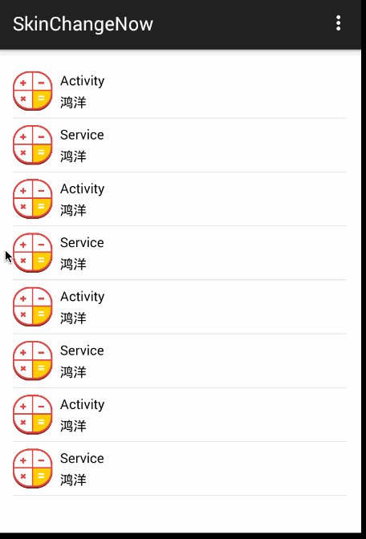
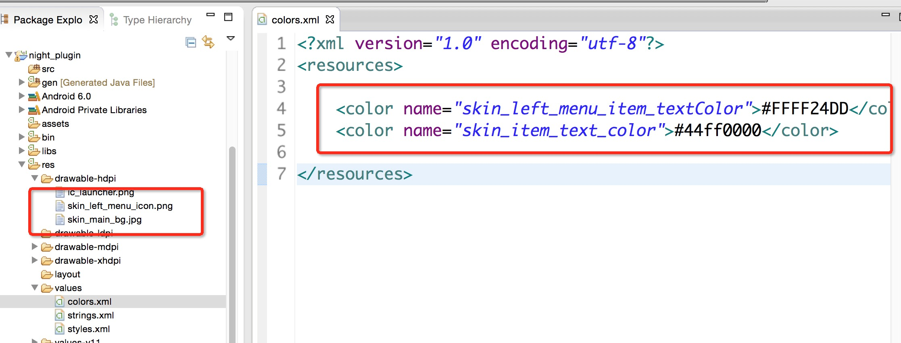
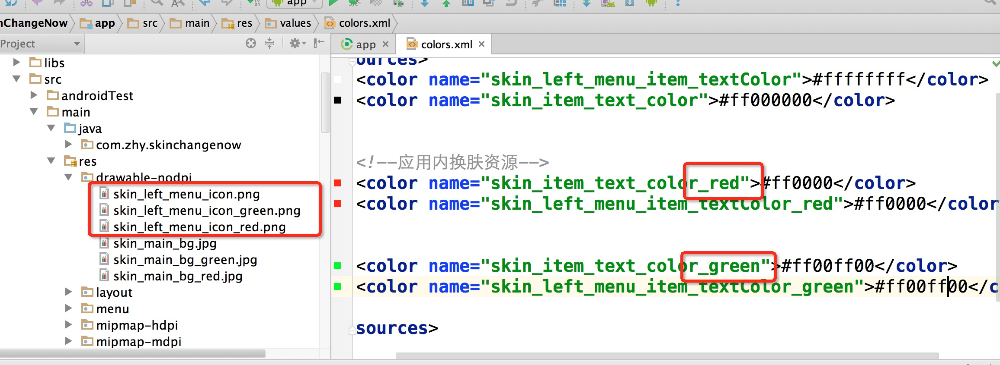

# ChangeSkin
基于插件式的Android换肤框架，支持app内和或者外部插件式提供资源的换肤方案，无需重启Activity。


- [致谢](#致谢)
- [支持](#支持)
- [Demo运行](#Demo运行)
- [使用](#使用)
- [声明](#声明)


## 致谢
* [Android换肤技术总结](http://blog.zhaiyifan.cn/2015/09/10/Android%E6%8D%A2%E8%82%A4%E6%8A%80%E6%9C%AF%E6%80%BB%E7%BB%93/)
* [github.com/fengjundev/Android-Skin-Loader](https://github.com/fengjundev/Android-Skin-Loader)
* [App Development: How to Get the Right LayoutInflater](http://willowtreeapps.com/blog/app-development-how-to-get-the-right-layoutinflater/)
* [LayoutInflater Factories](http://blog.bradcampbell.nz/layoutinflater-factories/)
* [Optimizing CustomViews](https://sriramramani.wordpress.com/2012/07/22/optimizing-customviews/)
* [https://github.com/bboyfeiyu/Colorful](https://github.com/bboyfeiyu/Colorful)

## 支持

* 插件的方式提供资源
* 应用内直接提供资源
* 一个插件包提供一套或者多套皮肤
* 应用内直接提供一套或者多套皮肤

## Demo运行


目前的demo，已经包含上述功能的测试。

下载[night_plugin.apk](night_plugin.apk)里面包含资源文件，放到手机或者模拟器SdCard的根目录。

然后import project，运行app。

运行效果图：



无需重启Activity，无缝换肤，资源均来自插件apk中。


## 使用

下载[changeskin](changeskin)，作为module依赖至主项目，例如：

```xml
dependencies {
     compile project(':changeskin')
}
```

或者直接添加依赖：

```xml
dependencies {
    compile 'com.zhy:changeskin:3.0.0'
}
```
### （1）初始化

#### 1、Application中初始化
在你的Application中，去初始化SkinManager，例如：

```java
public class MyApplication extends Application
{
    @Override
    public void onCreate()
    {
        super.onCreate();
        SkinManager.getInstance().init(this);
    }
}

```
别忘了注册。

####2、继承BaseSkinActivity
让所有的需要换肤的界面的Activity，继承自`com.zhy.changeskin.base.BaseSkinActivity`。

####3、对于需要换肤的资源命名使用skin开头

比如你的某个控件的背景需要换肤：

```xml
<android.support.v4.widget.DrawerLayout 
    android:background="@drawable/skin_main_bg"
    ... 
    />
```

字体颜色：

```xml
 <TextView android:id="@+id/id_tv_title"
      android:textColor="@color/skin_item_text_color"
        />
```
其他的类似。

接下来，针对插件式或者应用内准备皮肤资源即可。

### （2）插件式换肤

#### 1、准备资源apk

>只需要按规则定义下资源名称，然后几行代码就完成了换肤。

然后，单独准备一份插件apk，其实就是普通的项目，仅仅准备需要包含用到的资源即可。

例如：



搞成apk就不用说了吧。

#### 2、调用API

准备完成资源后，调用：

```java
SkinManager.getInstance().changeSkin(
	mSkinPkgPath, 
	"com.zhy.plugin", 
	new ISkinChangingCallback()
	{
	    @Override
	    public void onStart()
	    {
	    }
	
	    @Override
	    public void onError(Exception e)
	    {
	        Toast.makeText(MainActivity.this, "换肤失败", Toast.LENGTH_SHORT).show();
	    }
	
	    @Override
	    public void onComplete()
	    {
	        Toast.makeText(MainActivity.this, "换肤成功", Toast.LENGTH_SHORT).show();
	    }
});
```
即可完成换肤。第一个参数为插件apk的路径，第二个参数为插件apk的packageName.

记得设置读取存储卡权限。


当然你也可以调用

```java
SkinManager.getInstance().removeAnySkin();
```
重置为初始状态。

###（3）应用内换肤

#### 1、准备资源apk

这个就简单了，因为应用内换肤那么你肯定有多套资源，比如有一个背景图叫做：

skin\_main\_bg

那么你可以准备一套皮肤资源，命名为：

skin\_main\_bg\_后缀

这二个后缀你自己决定，例如：



上图，我准备了两套应用内的皮肤。

#### 2、调用换肤API

```java
  SkinManager.getInstance().changeSkin("red");
```

参数传入你的后缀名即可。

详情参考demo.


## 声明
感谢：[drakeet](https://github.com/drakeet)的提醒.

恩，看来得说明下，首先对于换肤，从Simple发布的Colorful项目开始关注，搜索了大量的资料，因为希望是可以支持插件式，一直寻找合适的资源替换方案，后来搜索到这篇博文[Android换肤技术总结](http://blog.zhaiyifan.cn/2015/09/10/Android%E6%8D%A2%E8%82%A4%E6%8A%80%E6%9C%AF%E6%80%BB%E7%BB%93/)，里面提到了一些方案。很开心的是，发现了这个库：[https://github.com/fengjundev/Android-Skin-Loader](https://github.com/fengjundev/Android-Skin-Loader)有极大的参考价值。该库通过为LayoutInfalter去设置自定义Factory，对加载的View进行分析和提取，方案还是不错的。

该库也就成为本库的一个资源替换原理的一个核心的突破点。

<del>当然，后来对于LayoutInflater.Factory又做了一些的分析，感觉侵入性有点大，主要担心对于AppCompat一些support的影响。
于是选择，直接重写Activity的onCreateView等方法。</del>(由于v7 23.0.1的变动，onCreateView只能作为private factory参与创建View了，时机太晚，该库方案也改为setFactory)
因为本库的预期准备支持app内和或者外部插件式提供资源的换肤方案，为了方便变采用了资源名称的约束，所以修改幅度较大，也就没准备针对Android-Skin-Loader库提交PR。

后面会编写博客叙述该库的原理等。


