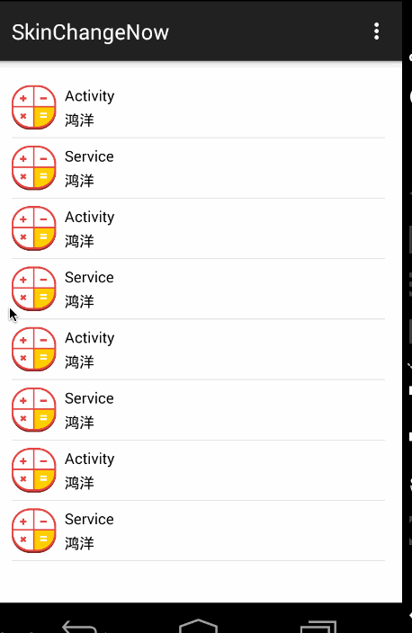

# ChangeSkin
基于插件式的Android换肤框架，支持app内和或者外部插件式提供资源的换肤方案，无需重启Activity。


## Demo运行

下载[night_plugin.apk](night_plugin.apk)里面包含资源文件，放到手机或者模拟器SdCard的根目录。

然后import project，运行app。

运行效果图：



无需重启Activity，无缝换肤，资源均来自插件apk中。


## 使用

>只需要按规则定义下资源名称，然后几行代码就完成了换肤。


下载[changeskin](changeskin)，作为module依赖至主项目，例如：

```xml
dependencies {
     compile project(':changeskin')
}
```

上传至jcenter后，会提供依赖，目前审核中...

### 1、Application中初始化
在你的Application中，去初始化SkinManager，例如：

```java
public class MyApplication extends Application
{
    @Override
    public void onCreate()
    {
        super.onCreate();
        SkinManager.getInstance().init(this);
    }
}

```
别忘了注册。

###2、继承BaseSkinActivity
让所有的需要换肤的界面的Activity，继承自`com.zhy.changeskin.base.BaseSkinActivity`。

###3、对于需要换肤的资源命名使用skin开头

比如你的某个控件的背景需要换肤：

```xml
<android.support.v4.widget.DrawerLayout 
    android:background="@drawable/skin_main_bg"
    ... 
    />
```

字体颜色：

```xml
 <TextView android:id="@+id/id_tv_title"
      android:textColor="@color/skin_item_text_color"
        />
```
其他的类似。


然后，单独准备一份插件apk，其实就是普通的项目，仅仅准备需要包含用到的资源即可。

例如：


搞成apk就不用说了吧。

###4、换肤API

准备完成资源后，调用：

```java
SkinManager.getInstance().changeSkin(
	mSkinPkgPath, 
	"com.zhy.plugin", 
	new ISkinChangingCallback()
	{
	    @Override
	    public void onStart()
	    {
	    }
	
	    @Override
	    public void onError(Exception e)
	    {
	        Toast.makeText(MainActivity.this, "换肤失败", Toast.LENGTH_SHORT).show();
	    }
	
	    @Override
	    public void onComplete()
	    {
	        Toast.makeText(MainActivity.this, "换肤成功", Toast.LENGTH_SHORT).show();
	    }
});
```
即可完成换肤。第一个参数为插件apk的路径，第二个参数为插件apk的packageName.

记得设置读取存储卡权限。


当然你也可以调用

```java
SkinManager.getInstance().removeAnySkin();
```
重置为初始状态。


